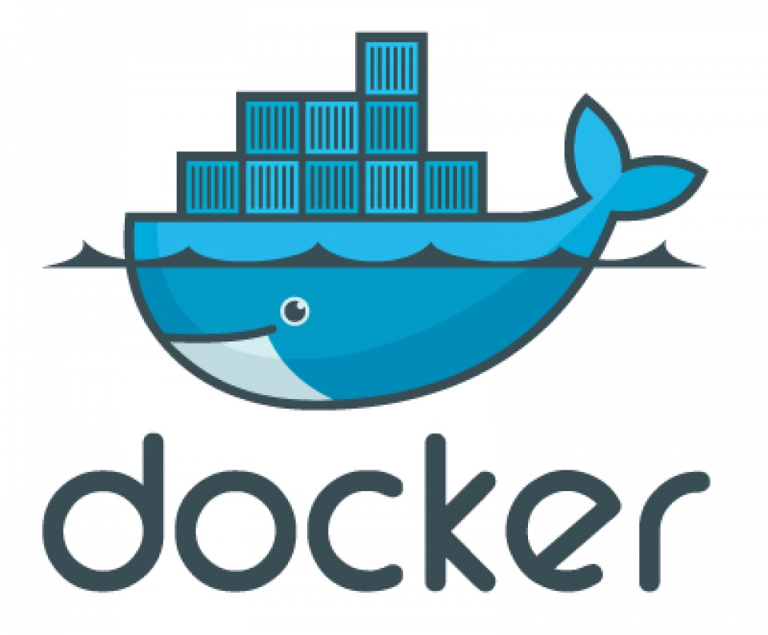
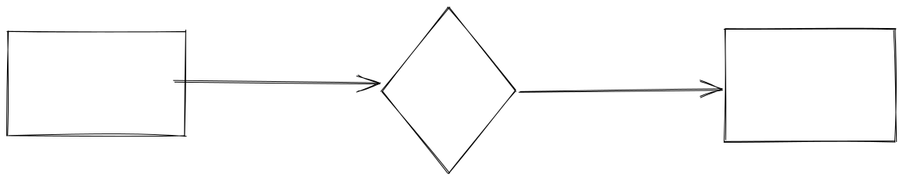

# Docker教程

<figure><figcaption><p>this is a caption</p></figcaption></figure>

## 第一章 Docker命令

### 第一节 镜像相关

#### 第一条 **搜索镜像**

```docker
docker search mysql
```

#### 第二条 **查看镜像历史版本**

```docker
curl https://registry.hub.docker.com/v1/repositories/mysql/tags

// 格式化结果（Linux下支持）
curl https://registry.hub.docker.com/v1/repositories/mysql/tags\
| tr -d '[\[\]" ]' | tr '}' '\n'\
| awk -F: -v image='mysql' '{if(NR!=NF && $3 != ""){printf("%s:%s\n",image,$3)}}docker
```

* aaa
* bbb

1. aaa
2. bbb

* [ ] undone
* [x] done


Hint


> Quote


this is a file



this is a link


| 产品名称 | 生产日期 | 价格 |
| ---- | ---- | -- |
| a    | 1999 | 23 |
| b    | 2000 | 24 |
| c    | 2001 | 25 |

<table data-view="cards"><thead><tr><th></th><th></th><th></th></tr></thead><tbody><tr><td></td><td>a</td><td></td></tr><tr><td></td><td>b</td><td></td></tr><tr><td></td><td>c</td><td></td></tr><tr><td>d</td><td></td><td></td></tr><tr><td>e</td><td></td><td></td></tr></tbody></table>



1



2



<details>

<summary>课程</summary>

## 第一课

### 第一节

</details>



$$
f(x) = x * e^{2 pi i \xi x}
$$








